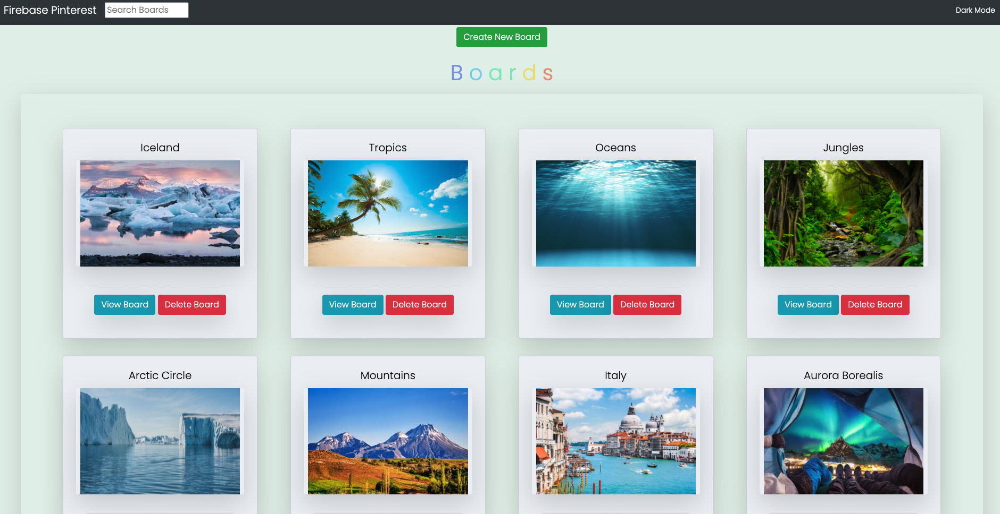

# Practically Pinterest
  This site allows you to log on to your account and view, edit, create, and delete your boards and pins!
### Link to your wireframes/prototype
  [Wireframe](https://www.figma.com/file/v4J2FtiVuWMIW0QgGPWNnd/Firebase-Pinterest?node-id=13%3A31)
### Link to the deployed project
  [Deployed Project](https://mg-firebase-pinterest.netlify.app/)
### Link to your project board
  [Project Board](https://github.com/GonzalesMatthew/ASSIGNMENT-Firebase-Pinterest/projects/1)
### Description of the user
  For those wanting to organize their interests using pins and boards to house them.
### List of features                                                
  Create, view, delete, and update pins and boards. Search bar to find boards, dark mode button. Google user authentication.
### Screenshots of your project

### List of contributors and links to their GH profiles
@GonzalesMatthew
### Link to Loom video walkthrough of your app
[App-Walkthrough Video](https://www.loom.com/share/366881ecf58044cb9c5cd00bbfc4e04b)
